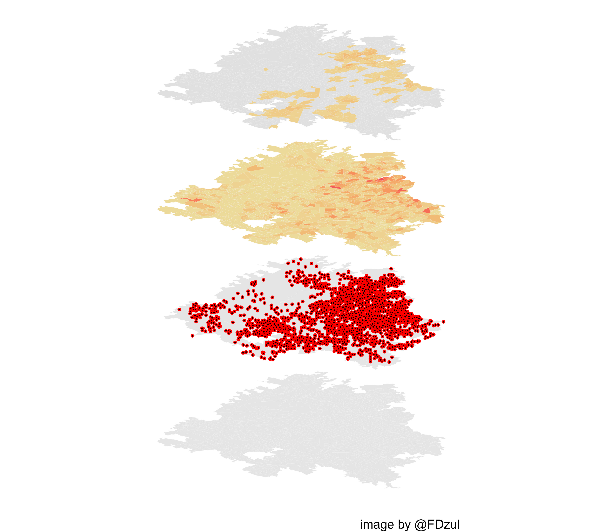

class: center, middle
```{r xaringan-fit-screen, echo=FALSE}
xaringanExtra::use_fit_screen()
```

```{r xaringanExtra, echo = FALSE}
xaringanExtra::use_progress_bar(color = "#0051BA", location = "top")
```

```{r xaringan-tachyons, echo=FALSE}
xaringanExtra::use_tachyons()
```

```{r share-again, echo=FALSE}
xaringanExtra::use_share_again()
```

```{r xaringan-logo, echo=FALSE}
xaringanExtra::use_logo(
  image_url = "https://www.uv.mx/v2/images/logouv.jpg",
  position = xaringanExtra::css_position(top = "1em", right = "1em")
)
```

## Planteamiento del Problema

---
### Hotspots de la transmisión del Dengue

&nbsp;

.pull-left[

.large[.justify-left[.blue[Los ***hotspots*** de las arbovirosis transmitidas por ***Aedes aegypti*** son definidas como aquellas áreas donde se concentra la mayor carga de la transmisión de los virus del dengue, chikungunya y/ó zika]]]

]
.pull-right[
.blue[Hotspots del área urbana de Veracruz]

]


.tiny[.blue[.footnote[Bisanzio  et al 2017; 
Dzul-Manzanilla et al 2021.]]]

---
class: center, middle
### Hotspots de la transmisión del Dengue


.tiny[.blue[.footnote[OPS, 2019]]]

---
class: center, middle
### Manejo Integrado de Aedes

<figure>
  
    </figcaption>
</figure>

.tiny[.blue[.footnote[Roiz et al. 2018; WHO, 2017]]]


---
class: center, middle
## Justificación
 
---
class: center,
## Justificación
.pull-left[
.blue[El desarrollo de un modelo estratégico de focalización de las acciones antivectoriales en las áreas urbanas endémicas de México y su implementación, constituye un elemento clave para redirigir los límitados recursos materiales, humanos y económicos a las áreas de los grandes centros urbanos donde la transmisión se concentra (basados en datos históricos) y donde las cadenas de transmisión son activas (datos actuales).]
]

.pull-right[
.blue[Hotspots del área urbana de Xalapa]

]
---
class: center,
## Justificación
&nbsp;

.pull-left[

.large[.justify-left[.blue[Teóricamente, de acuerdo a la ley de Pareto 80/20, si el 80% de la transmisión se concentra en el 20% del área urbana, la focalización de las acciones en el 20% del área, permitiría obtener reducciones del 80% de la carga de la enfermedad.]]]

]
.pull-right[
.blue[Hotspots del área urbana de Xalapa]

]
---
class: center, middle
### Modelo estratégico de focalización 

&nbsp;

.pull-left[
.blue[Concepto]


]
.pull-right[
.blue[Mapa de Riesgo]

]


.tiny[.blue[.footnote[Dzul-Manzanilla et al 2021.]]]
---
### Definición del Modelo estratégico de focalización 
&nbsp;

.pull-left[
- .red[**Áreas con riesgo muy alto de transmisión**.] Hotposts de casos + hotspots del vector. 

- .orange[**Áreas con riesgo alto de transmisión**.]  Hotspots de transmisión de casos.

- .yellow[**Áreas con riesgo medio de transmisión**.] Hotspots del vector.

- .green[**Áreas con riesgo bajo de transmisión**]. Sin hotspots del vector o hotspots de casos.
]

.pull-right[
Guadalajara
```{r, out.width = "90%", fig.fullwidth =TRUE, fig.width=10, fig.height=2, echo = FALSE, message=FALSE,dpi=300, warning=FALSE}
knitr::include_graphics("6.maps/map_risk_guadalajara.jpg")
```
]

---
class: center, middle
## Objetivo General
<hr style="height:2px;border-width:0;color:#330019;background-color:#330019"> 
### Desarollar un modelo estratégico de focalización del dengue en las áreas endémicas urbanas de México

---
## Objetivos Específicos 
<hr style="height:2px;border-width:0;color:#330019;background-color:#330019"> 

 - Determinar los hotspots del vector del dengue en México.

 - Determinar los hotspots de la transmisón de dengue.

 - Desarrollar un modelo de estratificación que incluya los hotspots del vector y los hotspots de los casos.

- Desarrollar un paquete en R para que el personal de salud del programa de prevención de dengue realice los hotspots del vector del dengue.

- Desarrollar un paquete en R para que el personal de salud del programa de prevención de dengue realice los hotspots de los casos de dengue.

- Escribir un manual para la identificación de los hotspots del vector del dengue


---
# Hipótesis
<hr style="height:2px;border-width:0;color:#330019;background-color:#330019"> 

La identificación de los hotspots del vector y los hotspots de la transmisión de dengue son factibles y operacionalmente posibles, y su concordancia espacial puede permitir diseñar un modelo estratégico de focalización en las áreas urbanas endémicas de dengue en México que combine la vigilancia entomológica y la vigilancia epidemiológica.


---
class: 
## Marco Teórico

### Antecedentes 

- Transmisión del dengue en México
- Transmisión de Chikungunya y Zika en México
Estratificación

### Estratificación 

- Estratificación epidemiológica del dengue en Mexico 

- Estratificación entomológica del dengue en Mexico 

- Estratificación epidemiológica y entomológica del dengue en Mexico 

### Análisis espacial

- Análisis espacial aplicado a la salud pública y la epidemiología

- Epidemiología espacial

- Datos espaciales

- Software libre para el análisis espacial

---
class: center, middle
## Propuesta Metodológica
<hr style="height:2px;border-width:0;color:#330019;background-color:#330019"> 
---
class: center, middle

### Hotspots de la Transmisión de Dengue
.pull-left[
1. Bajar las bases de datos del **[SINAVE](https://www.sinave.gob.mx/)**.
2. Geocodificar las bases.
3. Bajar los shapefile del **[INEGI](https://www.inegi.org.mx/)**.
4. Seleccionar la localidad de interes y extraer los AGEBs.
5. Contar el número de casos por AGEB.
6. Cálcular el Z-score de los casos.
7. Generar la matriz de adjacencias.
8. Cálcular el estadístico espacial local Getis&Ord $\color{#2ECC40}G_{\color{#2ECC40}i}^{\color{#2ECC40}*}$.
9. Realizar la la corrección de Bonferroni.
10. Cálcular los hotspots.
11. Visualizar los hotspots.
]
.pull-right[
```{r, dpi=300,echo=FALSE, fig.align ="center", out.width = "100%"}
DiagrammeR::grViz("digraph {

  # graph definitions
  graph [layout = dot, rankdir = TB]
  
  # node definitions
  node [shape = rectangle, style = filled, color = grey] 
  
  # flowchart for hotspots
  sinave [label = 'SINAVE',  fillcolor = 'SeaGreen', color = 'white', fontcolor = 'white']
  denv [label = 'Bases de DENV',  fillcolor = 'SeaGreen', color = 'white', fontcolor = 'white']
  geocode [label = 'Geocodificación',  fillcolor = 'SeaGreen', color = 'white', fontcolor = 'white']
  cases_ageb [label = 'Casos por AGEBs']
  z_score [label = 'Z-score']
  gi [label = 'Estadístico Espacial Local (Gi*)']
  bonferroni [label = 'Corrección de Bonferroni']
  hotspots [label = 'Hotspots', style = filled, color = orange]
  
  # flow chart for inegi
  inegi [label = 'INEGI', fillcolor = 'DeepSkyBlue', color = 'white', fontcolor = 'black']
  loc [label = 'Localidades Shapefile', fillcolor = 'DeepSkyBlue', color = 'white', fontcolor = 'black']
  ageb [label = 'AGEB Shapefile', fillcolor = 'DeepSkyBlue', color = 'white', fontcolor = 'black']
  loc_esp [label = 'Localidad de Ínteres', fillcolor = 'DeepSkyBlue', color = 'white', fontcolor = 'black']
  ageb_esp [label = 'AGEBs de la Localidad de Ínteres', fillcolor = 'DeepSkyBlue', color = 'white', fontcolor = 'black']
  mat [label = 'Matriz de Adjacencias', fillcolor = 'DeepSkyBlue', color = 'white', fontcolor = 'black']
  
  # edge definitions with the node IDs
  edge [color = black]
  sinave -> denv -> geocode -> cases_ageb -> z_score -> gi -> bonferroni -> hotspots 
  inegi -> {ageb, loc}
  loc -> loc_esp -> ageb_esp
  ageb -> ageb_esp
  ageb_esp -> mat
  mat -> cases_ageb 
 
  }", 
  height = 550)

```
]
---
### Hotspots del Vector

```{r, echo=FALSE,dpi=300,  fig.align ="center",out.height="70%", out.width = "90%"}
DiagrammeR::grViz("digraph {

  # graph definitions
  graph [layout = dot, rankdir = TB]
  
  # node definitions
  node [shape = rectangle, style = filled, color = grey] 
  
  #
  cenaprece [label = 'CENAPRECE',  fillcolor = 'SeaGreen', color = 'white', fontcolor = 'white']
  ovitrap [label = 'Ovitrampas',  fillcolor = 'SeaGreen', color = 'white', fontcolor = 'white']
  coord [label = 'Coordenadas',  fillcolor = 'SeaGreen', color = 'white', fontcolor = 'white']
  ovicoord [label = 'ovi + coord']
  
  # flow chart for inegi
  inegi [label = 'INEGI', fillcolor = 'DeepSkyBlue', color = 'white', fontcolor = 'black']
  loc [label = 'Localidades Shapefile', fillcolor = 'DeepSkyBlue', color = 'white', fontcolor = 'black']

  ###
  mesh [label = '1. Mesh']
  spde [label = '2. SPDE']
  
  proj_train [label = '3a. Projector Matrix A. Test']
  proj_test [label = '3b. Projector Matrix A. Train']
  
  spatial_field [label = '4. Spatial Field W']
  
  stack_train [label = '5a. Stack Train']
  stack_test [label = '5b. Stack Test']
  stack_pred [label = '5c. Stack Prediction']
  stack_joint [label = '6. Joint Stack']
  
  formula [label = '7. Formula']
  inla [label = '8. INLA',  fillcolor = 'Orange', color = 'white', fontcolor = 'white']
  
 
  
  # edge definitions with the node IDs
  edge [color = black]
  cenaprece -> {ovitrap, coord} -> ovicoord
  #
  inegi -> loc -> ovicoord
  #
  ovicoord -> mesh
  mesh -> spde -> spatial_field ->  stack_joint
  spde -> {proj_train,  proj_test}
  spatial_field -> {stack_test, stack_train, stack_pred} ->  stack_joint -> formula -> inla 
  proj_train -> stack_train
  proj_test -> stack_test

  
  }", 
  height = 500)

```

---

### Hotspots del Vector

```{r, echo=FALSE,dpi=300, fig.align ="center", out.height="70%", out.width = "90%"}
DiagrammeR::grViz("digraph {

  # graph definitions
  graph [layout = dot, rankdir = TB]
  
  # node definitions
  node [shape = rectangle, style = filled, color = grey] 
  
  #
  
  inla [label = '8. INLA',  fillcolor = 'Orange', color = 'white', fontcolor = 'white']
  stat [label = '9. Statistics']
  
  zeros [label = '9.1. % Zeros']
  disp [label = '9.2. Dispersion Statistics']
  dic [label = '9.3. Deviance Information Criterio']
  pear [label = '9.4. Pearson Residuals']
  
  ##
  p [label = 'Poisson']
  zip [label = 'ZeroInflated Poisson']
  nb [label = 'Negative Binomial']
  zinb [label = 'ZeroInflated Poisson Negative Binomial']
  
  sel [label = '10.Select the Distribution & Model']
  
  # prediction ####
  ext_pred [label = '11. Extract Index Prediction']
  coor_pred [label = '12. Extract Coordinates Prediction']
  pred [label = '13. Prediction']
 
  hotspots [label = '14.Hotspots', fillcolor = 'Orange', color = 'white', fontcolor = 'white']
  save [label = '15. Save results']
  
  mappred [label = '15a. Prediction Map']
  hotspotsb [label = '15b. Hotspots']
  dics [label = '15c. DICs']
  loc [label = '15d. Locality']
  data [label = '15e. Dataset']
  
  # edge definitions with the node IDs
  edge [color = black]
  inla -> stat
  stat -> {zeros, disp, dic,pear} -> {p, zip, nb, zinb} -> sel
  sel -> ext_pred -> coor_pred -> pred -> hotspots -> save
  save -> {mappred, hotspotsb, dics, loc, data}

  
  }", 
  height = 500)

```

---
class: center, middle
## Cronograma de Actividades

```{r,dpi=300, echo=FALSE, fig.align ="center", out.width = "100%"}
library(timevis)
a <- timevis::timevis(data = data.frame(start = c("2021-06-01", 
                                                  "2021-08-01",
                                                  "2021-08-01",
                                                  "2021-09-01",
                                                  "2021-07-01",
                                                  "2021-09-01", 
                                                 "2022-02-01",
                                                  "2022-03-01"),
                                        end = c("2021-08-31", 
                                                "2021-08-31", 
                                                "2022-01-31",
                                                "2022-01-31", 
                                                "2021-08-31", 
                                                "2022-01-31", 
                                                "2022-04-31",
                                                "2022-06-01"),
                                        #style = c("color: darkblue; font-size: 15px; border-color: darkblue; border: 2px solid darkblue;"),
                                        content = c("Manejo de la Información & Bases de Datos", 
                                                    "Identificación de Localidades", 
                                                    "Predicción del Número de Huevos",
                                                    "Hotspots del Vector",
                                                    "Geocodificación de Casos",
                                                    "Hotspots de Casos",
                                                    "Concordancia Espacial",
                                                    "Modelo de Estratificación"),
                                        #type = c("background"),
                                        style = c("text-align: center; font-weight: bold; color: black; font-size: 15px; border-color: darkred; border: 2px solid black; background-color: firebrick;",
                                                  "text-align: center; font-weight: bold; color: black; font-size: 15px; border-color: darkblue; border: 2px solid black; background-color: firebrick;",
                                                  "text-align: center; font-weight: bold; color: black; font-size: 15px; border-color: darkblue; border: 2px solid black; background-color: firebrick;", 
                                                  "text-align: center; font-weight: bold; color: black; font-size: 15px; border-color: darkgreen; border: 2px solid black; background-color: firebrick;",
                                                  "text-align: center; font-weight: bold; color: black; font-size: 15px; border-color: darkorange; border: 2px solid black; background-color: dodgerblue;", 
                                                  "text-align: left; font-weight: bold; color: black; font-size: 15px; border-color: darkorange; border: 1.5px solid black; background-color: dodgerblue;", 
                                                  "text-align: righ; font-weight: bold; color: black; font-size: 15px; border-color: darkorange; border: 1px solid gray; background-color: darkgreen;",
                                                  "text-align: righ; font-weight: bold; color: black; font-size: 15px; border-color: darkorange; border: 1px solid gray; background-color: darkorange;"),
                                        group = c(1, 1, 1, 1, 2, 2,3, 4)),
                      groups = data.frame(id = 1:4, 
                                          content = c("Objetivo I", 
                                                      "Objetivo II",
                                                      "Objetivo III",
                                                      "Objetivo IV"),
                                          style = c("text-align: center; font-weight: bold; color: black; font-size: 20px; border-color: darkred; border: 2px solid black; background-color: firebrick;",
                                                    "text-align: center; font-weight: bold; color: black; font-size: 20px; border-color: darkblue; border: 2px solid black; background-color: dodgerblue;",
                                                    "text-align: center; font-weight: bold; color: black; font-size: 20px; border-color: darkgreen; border: 2px solid black; background-color: darkgreen;",
                                                    "vertical-align: middle; text-align: center; font-weight: bold; color: black; font-size: 20px; border-color: darkorange; border: 2px solid black; background-color: darkorange;")))

a


style <- "
.vis-time-axis { 
background-color: lightgray;
backgroud-border: 3px solid #73AD21;
backgroun-opacity; 0.1;
font-weight: bold;
text-align: center;
vertical-align: middle;
border: 1.5px solid #73AD21;
font-size: 15px;}
.vis-odd {
color: blue;
vertical-align: middle;
  }

"
htmltools::html_print(htmltools::tagList(htmltools::tags$style(style), a))


```
---
## Resultados Preliminares

- Hotspots de la transmisión del dengue en 13 localidades de Veracruz
- Hotspots del vector en 10 localidades de Veracruz.
- Aplicación del modelo de focalización en 10 localidades de Veracruz.


- [Manual de identificación de los hotspots](https://fdzul.github.io/manual_hotspots/)

- Un paquete en R para la identificación de los hotspot de casos
[denhotspots](https://github.com/fdzul/denhotspots)

- Un paquete en R para la identificación de hotspots del vector
[deneggs](https://github.com/fdzul/deneggs)

---
# Thanks!
<hr style="height:2px;border-width:0;color:#330019;background-color:#330019"> 

&nbsp;

- ***email***      :     felipe.dzul.m@gmail.com

- ***celular***    :     228 229 3419

- ***github***     :     [https://github.com/fdzul]()

- ***slides***     :     [https://reverent-khorana-420d9e.netlify.app/#1]()


.footnote[La presentación fue creada via [**xaringan**](https://github.com/yihui/xaringan),
[**revealjs**](https://revealjs.com/),
[remark.js](https://remarkjs.com), [**knitr**](http://yihui.name/knitr),
& [R Markdown](https://rmarkdown.rstudio.com) en [R]() & [RStudio](2.R_Scripts/libs/rstudio_leaflet/rstudio_leaflet.css).]


